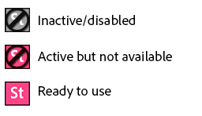
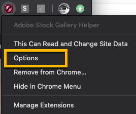
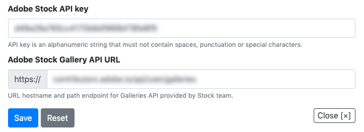

# Stock Gallery Helper
Extension for Chrome to manage Stock galleries

This is sample code is a work in progress. 

## Usage

See the tutorial at https://adobe.ly/34aQ3po. This covers part of the installation except for the new step of adding your own API key and Gallery API endpoint--see Installation instructions below.

## Installation

Download everything in the `src` folder to a local drive, or expand the contents of the latest zip file.

Open Chrome, [open Extensions](chrome://extensions/), enable "Developer Mode", and click the "Load unpacked" button. Then browse to the `src` folder that you extracted above. The extension should appear as a small icon on the toolbar.

The toolbar icon has three states: inactive, loaded (but not available) and available.

- Inactive/disabled: The extension will not work on this page. This will be the default icon shown unless the user is navigating the Adobe Stock website.
- Active but unavailable: The extension has recognized that the user is on the Adobe Stock website, but cannot be used because the user is not signed in, and/or the user is not on a Libraries page.
- Available/ready: User can click the icon to open the Gallery Helper UI.

**Important!** Before it is functional, you will need to provide two pieces of information in the options dialog of the extension. The options page should open if you have not populated this info, but here are manual instructions:

1. Right-click on the Stock Gallery Helper icon and choose **Options**.

2. Fill in the form with your own Stock API key and Gallery API endpoint URL. 
   - You can get a free Adobe developer account and Adobe Stock API key using the [I/O Console](https://console.adobe.io/).
   - The API endpoint will be provided by the Stock team on request: [stockapis@adobe.com](mailto:stockapis@adobe.com?subject=%5BAdobe%20I%2FO%5D%20Galleries%20API).

3. Save your configuration. The extension is now ready to use. 

If you have questions about the API or the sample code, please contact [stockapis@adobe.com](mailto:stockapis@adobe.com?subject=%5BAdobe%20I%2FO%5D%20Galleries%20API).

## Contributing

Contributions are welcomed! Read the [Contributing Guide](https://github.com/adobe/stock-api-samples/blob/master/CONTRIBUTING.md) for more information.

## Licensing

This project is licensed under the Apache V2 License. See [LICENSE](https://github.com/adobe/stock-api-samples/blob/master/LICENSE) for more information.
