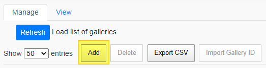
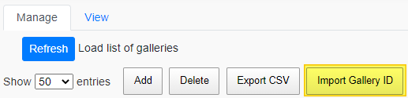
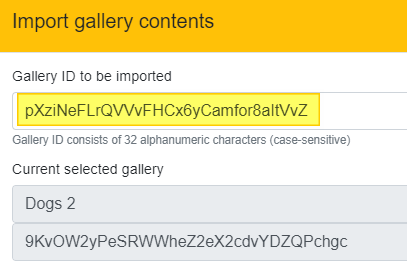
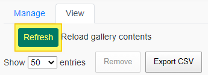

# Stock Gallery Helper
Extension for Chrome to manage Stock galleries

This is sample code and is a work in progress. 

## Installation

Download everything in the `src` folder to a local drive, or expand the contents of the latest zip file.
  
Open Chrome, [open Extensions](chrome://extensions/), enable "Developer Mode", and click the "Load unpacked" button. Then browse to the `src` folder that you extracted above. The extension should appear as a small icon on the toolbar.

The toolbar icon has three states: inactive, loaded (but not available) and available.

- Inactive/disabled: The extension will not work on this page. This will be the default icon shown unless the user is navigating the Adobe Stock website.
- Active but unavailable: The extension has recognized that the user is on the Adobe Stock website, but cannot be used because the user is not signed in, and/or the user is not on a Libraries page.
- Available/ready: User can click the icon to open the Gallery Helper UI.

**Important!** Before it is functional, you will need to provide two pieces of information in the options dialog of the extension. The options page should open if you have not populated this info, but here are manual instructions:

1. Right-click on the Stock Gallery Helper icon and choose **Options**.

2. Fill in the form with your own Stock API key and Gallery API endpoint URL. 
   - You can get a free Adobe developer account and Adobe Stock API key using the [I/O Console](https://console.adobe.io/).
   - The API endpoint will be provided by the Stock team on request: [stockapis@adobe.com](mailto:stockapis@adobe.com?subject=%5BAdobe%20I%2FO%5D%20Galleries%20API).
  

3. Save your configuration. The extension is now ready to use. 

If you have questions about the API or the sample code, please contact [stockapis@adobe.com](mailto:stockapis@adobe.com?subject=%5BAdobe%20I%2FO%5D%20Galleries%20API).

## Usage

See the tutorial at https://adobe.ly/34aQ3po. This covers basic usage of the extension except for the Gallery Import function, which is explained below.

### Gallery import
As of version 0.1.5, it is now possible to import external gallery content into a gallery you own. This is useful for example if you used to manage galleries under Fotolia but they do not appear when using this new workflow. This will recreate the gallery with a new ID.

For these instructions, you need to have the ID of an _existing_ gallery. You can preview the contents of any gallery using this URL (substitute your gallery ID):
https://stock.adobe.com/collections/pXziNeFLrQVVvFHCx6yCamfor8aItVvZ

1. Open the extension. If you have not entered the Gallery endpoint and API key, do so now.

2. On the _Manage_ tab, click __Add__ to create a new, blank gallery.

3. Select the row of the gallery you just created so it is selected, and click __Import Gallery ID__.

4. In the dialog box, type or paste the ID of the existing gallery to be imported. _This operation cannot be undone. It will add (rather than replace) the contents of your new gallery._ 

5. Verify the ID to be imported, and click __Yes__ at the next prompt. The operation may take a few seconds.

6. Once complete, switch to the _View_ tab and click __Refresh__ to see the updated contents. Please note there is an existing bug in the APIs which does not properly report the number of assets in the gallery when on the _Manage_ tab, however switching to _View_ and refreshing the contents will give you the correct number.

## Contributing

Contributions are welcomed! Read the [Contributing Guide](https://github.com/adobe/stock-api-samples/blob/master/CONTRIBUTING.md) for more information.

## Licensing

This project is licensed under the Apache V2 License. See [LICENSE](https://github.com/adobe/stock-api-samples/blob/master/LICENSE) for more information.
