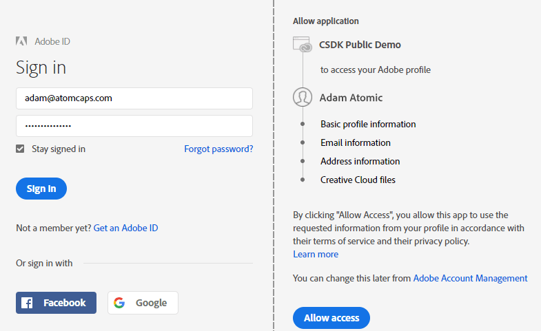

# Adobe IMS auth code sample code (Node.js)

## Contents
+ [Sample code structure](#user-content-sample-code-structure)
+ [Installation](#user-content-installation)
    * [Creating an API Key](#user-content-creating-an-api-key)
    * [Creating a Self-Signed Certificate](#user-content-creating-cert)
    * [Optional: Edit your HOSTS file](#user-content-hosts)
+ [Starting the server](#user-content-starting-the-server)
+ [Using the sample app](#user-content-using-the-sample-app)
    * [Logging in](#user-content-logging-in)
    * [Accessing a protected API](#user-content-accessing-a-protected-api)
    * [Logging out](#user-content-logging-out)

This is a sample web application which demonstrates how to authenticate a user for Adobe IMS using the OAuth "auth code" workflow. The end goal for this example is to allow the user to access Adobe Stock licenses and entitlements.

This code is a companion to the whitepaper [Authorization code workflow for Stock](./stock-authorization-code-workflow.pdf). Refer to that for the complete Adobe IMS authentication flow. For reference, this PDF is in the same folder as the README file.

## Sample code structure

Application code is contained in two top levels folders: __server__ and __www__.

+ App server (__/server__): This contains all the code needed to (1) start an instance of an HTTPS server, and (2) perform the bulk of the auth code work. This runs in Node.js and uses the Express web server.
    * __authcode_server__: Main server module, written for Node.js.
    * __config.json__: Configuration file for server. See _Creating an API Key_, below.
    * __package.json__: Used by Node.js to install project dependencies.
    * __/ssl__: Stores public and private keys. See _Creating a Self-Signed Certificate_, below.
+ App client (__/www__): These are static web files that form the front-end client of the application. The page uses Ajax to communicate with the app server script, and could easily be used with any server technology.
    * __login-authcode.html__: Basic HTML with simple UI controls for app.
    * __login-authcode.js__: Front-end logic for UI.

Note that all JavaScript in this example uses [ECMAScript6 (ES6)](http://es6-features.org/) syntax. If you are not running a modern browser, you can easily convert the code using an online tool like https://es6console.com/. 

## Installation

1. Install [Node.js](https://nodejs.org/en/).
2. Open a command prompt/terminal, navigate to the __./server__ folder (folder which contains __package.json__) and run this command:

```bash
$ npm install
```
This should download all required modules, such as [Express](http://expressjs.com/).

### Creating an API Key

Before you can access Adobe Stock APIs (or any Adobe API), you will need to obtain an API key for your application by registering it at Adobe I/O. This requires a free Adobe ID account.

1.  Access the Adobe I/O Console here: https://console.adobe.io. If you do not have an Adobe account, you will be prompted to create one.
2.  Click the __New Integration__ button.
3.  Select the following items, clicking __Continue__ each time:
> __Access an API__ - __Creative SDK__   - __New integration__

Note that the API should be _Creative SDK_ and __not__ _Adobe Stock_. The reason is that the Creative SDK integration contains the proper OAuth scopes required to access the login service.

4.  This opens a screen where you will enter your integration details.
    - __Name__: Your application’s name.  
    - __Description__: E.g., “Integration of Stock API with MyWebsite.com.”
    - __Platform__: Choose Web.  
    - __Default redirect URI__: This is the default callback URL of the page or script which Adobe will access during the authentication process. It must be hosted on a secure (HTTPS) server. If you are not using a custom HOSTS file mapping, put https://localhost/auth/token.
    - __Redirect URI pattern__: This is a URI path (or comma-separated list of paths) to which Adobe will attempt to redirect when the login flow is complete. You must escape periods (.) with \\\ (example: https://mysite\\.com/). Again, if you are not using a HOSTS file, use https://localhost/.
5.  Once saved, the I/O Console will generate several pieces of information you will need later. 
    - Copy everything in the Client Credentials section: __API Key__ and __Client Secret__, which you must safeguard like your private key
6.  Update the `API_KEY` and `SECRET` properties in the __config.json__ file. At this time, you can also give your app a name under `API_APPNAME`. This is primarily for logging purposes.

```
  "API_KEY": "61c8af59676748a2943d1449b576a438",
  "SECRET": "9eb77034-e0de-49a3-99dd-6a7162659d6d",
  "API_APPNAME": "DanStockApp/1.0",
```

### <a name="creating-cert"></a>Creating a Self-Signed Certificate

If you already have a certificate and private key for your website, or if you created one previously, place these in the __/server/ssl__ folder. Be sure to update __config.json__ with the proper names of your cert and private key.

Assuming you do not have this, you will need to generate it. This will provide HTTPS support for your server. Note that self-signed certificates should only be used for local testing, _never in production_. The steps below require [OpenSSL](https://www.openssl.org/), which is pre-installed on Mac and Linux systems, but not on Windows. For Windows, you can either compile from the source code, or download a pre-compiled binary from [OpenSSL for Windows](http://gnuwin32.sourceforge.net/packages/openssl.htm) or [SourceForge](https://sourceforge.net/projects/openssl/). Once downloaded, you will either need to add the OpenSSL folder to your path, or run this command from the same directory. Alternatively, you could use PowerShell on Windows by following [this guide](https://www.petri.com/create-self-signed-certificate-using-powershell).

1. Open a command prompt/terminal.
2. Run this command to generate both a certificate and private key in one step.
```bash
$ openssl req -x509 -sha256 -nodes -days 365 -newkey rsa:2048 -keyout server.key -out server.crt
```
You will be prompted to fill out a few fields; you can put whatever you want. Once you are finished, you should see two new files in your current directory: __server.key__ and __server.crt__. Move these to the __/server/ssl__ folder.

### <a name="hosts">Optional: Edit your HOSTS file</a>

By default, your server will be available at https://localhost:8443 or https://127.0.0.1:8443. If you want to give your server a "name," you can add an alias in your system HOSTS file.

1. Locate your HOSTS file. 
    * Mac\Linux: __/etc/hosts__
    * Windows: __c:\windows\system32\drivers\etc\hosts__
2. Edit it with a text editor. On Windows, you will need to run the editor in Administrator mode, and on the Mac, you will be prompted to enter your sytem password when you save (unless you use the `sudo vim` method from the command line, in which case you will enter your password first. 
3. At the bottom of the file, add a line like this and save:

```
127.0.0.1 mygreatsite.com
```

There is a complete guide to editing this file at [How-To Geek](https://www.howtogeek.com/howto/27350/beginner-geek-how-to-edit-your-hosts-file/).

4. Now when you start the server, you can access it at both https://localhost:8443 and https://mygreatsite.com/.
5. _Important!_ You will also want to add this new domain as a Redirect URI to your Adobe I/O application configuration, otherwise the authentication will fail. Your Redirect URI pattern will look something like this:

```
https://localhost/(.*),https://mygreatsite\\.com/(.*)
```

## Starting the server

1. Open a command prompt/terminal, navigate to the __/server__ folder, and run either of these commands:

```bash
$ node authcode_server.js
```
This will start the server normally.
```bash
$ node --inspect authcode_server.js 
```
This will start the server and enable the inspector agent, allowing you to easily debug your server code in Chrome using its developer console. Go [here](https://nodejs.org/en/docs/guides/debugging-getting-started/) for more information. In addition, multiple console.log statements were added to the server code to aid in this process, such as an output of all HTTP requests.

The terminal should display: 

  >  If you don't see any errors, open in your browser:
  >  
  >  https://127.0.0.1:8443/

2. Open a web browser and navigate to https://localhost:8443, https://127.0.0.1:8443, or the custom domain you added to your HOSTS file.
3. You will be prompted that your connection is not secure. This is expected, because your self-signed certificate was not issued by an official provider, and you did not trust the certificate on your system. That's okay. Simply go ahead and allow it as an exception.

Your browser should show a success message.

> Node.js HTTPS server test
>
> Success!

## Using the sample app

Now that the server is configured and running, you can run the sample application.

### Logging in
1. Navigate to https://localhost:8443/login-authcode.html. The file will be served from the /www directory.
2. Click __Log into Creative Cloud__. If all goes well, you should see the Adobe SUSI (Sign Up/Sign In) page.

Behind the scenes, the login button calls to the /auth/login endpoint on the Node/Express server, and the server redirects to /ims/authorize on IMS.

```javascript
router.get('/auth/signin', (req, res) => {
  let query = `client_id=${CONFIG.API_KEY}&redirect_uri=${CONFIG.REDIRECT_URI}`;
  query += `&scope=${CONFIG.SCOPES}&response_type=code`;
  saveReferer(req.get('Referer'));
  res.redirect(`https://${CONFIG.IMS_HOSTNAME}/ims/authorize?${query}`);
});
```

If you are monitoring the HTTPS traffic in the developer console, you should the web client get redirected to the IMS login endpoint.

```http
GET /auth/signin HTTP/1.1
Host: localhost:8443

HTTP/1.1 302 Found
Location: https://ims-na1.adobelogin.com/ims/authorize
  ?client_id=3a67c...
  &redirect_uri=https://localhost:8443/auth/token
  &scope=openid,creative_sdk
  &response_type=code
```

3. Sign in using your Adobe ID (or sign up for a new ID). You will be prompted to grant permissions to your application to access your account.



The browser should now redirect back to your server, to your redirect URI endpoint, with the authorization code.

```http
GET /auth/token?code=eyJ4NXU...vkCnh9Q
HTTP/1.1
Host: localhost:8443
```

The local redirect endpoint is /auth/token. Because this same endpoint is called for login and logout, an `else` statement checks to see if the query string contains a `code` parameter. If it does, its a signin event, and if not, a signout.

```javascript
router.get('/auth/token', (req, res) => {
  const code = req.query.code;
  if (code) { 
    // process login
  } else { 
    // process logout
  }
});
```

4. Once IMS has redirected back to your endpoint with the auth code, you will POST the code to /ims/token to receive an access token and a refresh token. This request is sent as a form, with the client ID, secret and auth code in the body as parameters.

```javascript
const reqOptions = {
hostname: CONFIG.IMS_HOSTNAME,
path: '/ims/token',
method: 'POST',
headers: {
  'Content-Type': 'application/x-www-form-urlencoded',
},
};
const requestForm = {
grant_type: 'authorization_code',
client_id: CONFIG.API_KEY,
client_secret: CONFIG.SECRET,
code: authCode,
};
console.log('POST body:', requestForm);
return httpRequest(reqOptions, requestForm);
```

```http
POST /ims/token HTTP/1.1
Host: ims-na1.adobelogin.com
Content-Type: application/x-www-form-urlencoded
  grant_type=authorization_code
  &client_id=3a67c...
  &client_secret=12e7...
  &code= eyJ4NXU...vkCnh9Q

HTTP/1.1 200 OK
Content-Type: application/json;charset=UTF-8
{
    "access_token": "eyJ4NXU...qOk8-DA",
    "refresh_token": "eyJ4NXU...ZoQP_5A",
    "name": "Adam Atomic",
    "token_type": "bearer",
}
```

5. The POST is returned in a Promise, which is processed with a `then()` statement. The data includes the access and refresh token, as well as the IMS profile of the user. This can either be stored on the server in a database, or stored locally in session cookies. Be sure the cookies are marked as HTTP-only, to prevent cross-site scripting (XSS) attacks. Do not save in Document.cookie, or else the data will be vulnerable. Finally, the server app redirects back to the web app signin page, with a parameter instructing it to show the signed-in state.

```javascript
const tokenRequest = requestImsToken(code);
tokenRequest.then((data) => {
  const session = {
    access_token: body.access_token,
    refresh_token: body.refresh_token,
    account_type: body.account_type,
    expires: body.expires_in,
    displayName: body.name,
  };
  req.session.profile = session;
  res.redirect(`${clientAppRefer}?signed_in=true`);
}
```

### Accessing a protected API

You will use the access token to call an API that requires authentication, such as the Stock Licensing API. The Licensing API requires the access token to be passed in the header. The sample app calls the /Member/Profile API, which returns the user's available quota of Stock credits.

1. The user initiates the action, which calls the /profile/quota endpoint on the application server. The server reads the access token from the session cookie, and makes a request to the /Member/Profile API. Again, the response is returned in a Promise.

```javascript
router.get('/profile/quota', (req, res) => {
  const quotaResponse = { quota: 0 };
  const token = req.session.profile.access_token;
  const profileRequest = getMemberProfile(token);
});
```

The body of the getMemberProfile function.

```javascript
const params = {
  license: 'Standard',
  locale: 'en_US',
};
const headers = {
  'X-Product': CONFIG.API_APPNAME,
  'x-api-key': CONFIG.API_KEY,
  Authorization: `Bearer ${token}`,
};
const options = {
  hostname: CONFIG.API_HOSTNAME,
  path: `/Rest/Libraries/1/Member/Profile?${querystring.stringify(params)}`,
  method: 'GET',
  headers,
};
```

2. The Adobe Stock server returns a JSON response containing the number of credits (which will be 0 if you do not have a subscription plan), and other data corresponding to the account type.

```http
GET /Rest/Libraries/1/Member/Profile?content_id=117487990&locale=en_US HTTP/1.1
Host: stock-stage.adobe.io
X-Product: IMSDemo
x-api-key: 3a67c...
Authorization: Bearer eyJ4NXU...qOk8-DA

{
    "available_entitlement": {
        "quota": 85,
        "license_type_id": 15,
        "has_credit_model": true,
        "has_agency_model": false,
        "is_cce": true,
        "full_entitlement_quota": {
            "credits_quota": 75,
            "image_quota": 85
        }
    }
}
```

The application wraps the response in a Promise, and the quota value is extracted from the returned data.

```javascript
profileRequest.then((data) => {
  quotaResponse.quota = data.available_entitlement.quota;
  res.send(quotaResponse);
});
```

3. The server app notifies the client page when the quota is available.

```http
GET /profile/quota HTTP/1.1
Host: localhost:8443
Referer: https://localhost:8443/login-authcode.html?signed_in=true
Cookie: session=eyJwcm...x0rbU

HTTP/1.1 200 OK
Content-Type: application/json; charset=utf-8

{"quota":85}
```


### Logging out

1. When the user is ready to sign-out, he/she clicks the logout button, which calls to the /auth/logout endpoint on the Node/Express server, which redirects to /ims/logout on IMS. 

```http
GET /auth/signout HTTP/1.1
Host: localhost:8443

HTTP/1.1 302 Found
Location: https://ims-na1.adobelogin.com/ims/logout
  ?access_token=eyJ4NXU...qOk8-DA
  &redirect_uri=https://localhost:8443/auth/token
```

2. When the process is finished on the Adobe IMS side, IMS redirects the browser back to the redirect URI, and your app can notify the front end so the UI can be updated to show the signed-out state.

```http
GET /ims/logout_response
  ?redirect_uri=https://localhost:8443/auth/token
  &client_id=3a67c... HTTP/1.1
Host: ims-na1.adobelogin.com

HTTP/1.1 302 Found
Content-Type: text/html;charset=UTF-8
Location: https://localhost:8443/auth/token
```

3. The app clears the session cookies, and instructs the client page to show the signed-out state.

```javascript
req.session = null;
console.log('logout completed');
res.redirect(`${clientAppRefer}?signed_in=false`);
```

## Contributing

Contributions are welcomed! Read the [Contributing Guide](CONTRIBUTING.md) for more information.

## Licensing

This project is licensed under the Apache V2 License. See [LICENSE](LICENSE) for more information.