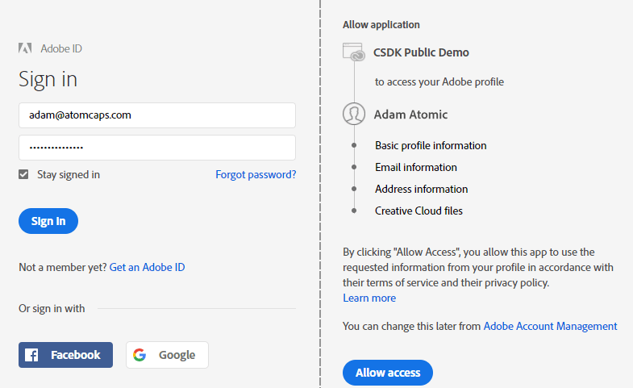

# Adobe IMS auth code sample code (PHP)

## Contents
<!-- MarkdownTOC levels="1,2,3" autolink="true" -->

- [Adobe IMS auth code sample code (PHP)](#adobe-ims-auth-code-sample-code-php)
  - [Contents](#contents)
  - [Requirements](#requirements)
  - [Sample code structure](#sample-code-structure)
  - [Installation](#installation)
    - [Creating an API Key](#creating-an-api-key)
    - [<a name="creating-cert"></a>Creating a Self-Signed Certificate](#creating-a-self-signed-certificate)
  - [Using the sample app](#using-the-sample-app)
    - [Logging in](#logging-in)
    - [Accessing a protected API](#accessing-a-protected-api)
    - [Logging out](#logging-out)
  - [Contributing](#contributing)
  - [Licensing](#licensing)

<!-- /MarkdownTOC -->

This is a sample web application which demonstrates how to authenticate a user for Adobe IMS using the OAuth "auth code" workflow. The end goal for this example is to allow the user to access Adobe Stock licenses and entitlements.

This code is a companion to the whitepaper [Authorization code workflow for Stock](./Stock-Authorization-Code-Workflow.pdf), also located in this repo. Refer to that for the complete Adobe IMS authentication flow. For reference, this PDF is in the same folder as the README file.

## Requirements
This code was written for PHP 7.2 (although lower versions should work), and requires Apache 2.4 server with mod_rewrite enabled, as well as mod_ssl enabled. The Adobe OAuth workflow requires HTTPS for redirects. In addition, your Apache configuration needs to allow use of .htaccess files, or the commands need to be added to your main __httpd__ configuration files. To install the necessary PHP libraries, you will also need [Composer](https://getcomposer.org/).

## Sample code structure

Application code is contained in two top levels folders: __src__ and __www__. In addition, there is a sample Apache `.htaccess` file provided as part of the sample. This is required to reside in the root folder of the project.

+ PHP scripts (__/src__): This contains the server-side logic that communicates with Adobe IMS.
    * __Router.php__: Redirects traffic from front-end web page to IMS endpoints. This is called indirectly by `.htaccess`.
    * __Config.php.SAMPLE__: Configuration file for server. See _Creating an API Key_, below. Once you add your configuration info, rename this file as __Config.php__ or nothing will work!
    * __AuthCode.php__: Main class which contains authentication routines. 
    * __Profile.php__: Class that communicates with Adobe Stock to get quota data.
    * __Utils.php__: Utility class that performs shared static functions such as Guzzle (curl) requests and logging.
+ Browser app (__/www__): These are static web files that form the front-end client of the application. The page uses Ajax to communicate with the PHP script, and could easily be used with any server technology.
    * __login-authcode.html__: Basic HTML with simple UI controls for app.
    * __login-authcode.js__: Front-end logic for UI.
+ Apache configuration file (__.htaccess__): This redirects all static traffic (.html, .js, .css, etc.) to the `www` folder, while directing everything else to the main `Router.php` script.
+ Log file (__/logs__): Logs detailed server responses from IMS and Stock to a file `router.log`.

Note that all JavaScript in the example uses [ECMAScript6 (ES6)](http://es6-features.org/) syntax. If you are not running a modern browser, you can easily convert the code using an online tool like https://es6console.com/. 

## Installation

1. Install PHP and Apache. The simplest way to do this is to use a WAMP or MAMP stack, such as [XAMPP](https://www.apachefriends.org/index.html) or [AMPPS](https://www.ampps.com/).
2. Most Apache stacks have `.htaccess` enabled by default, but you can find tutorials [like this one](https://www.digitalocean.com/community/tutorials/how-to-use-the-htaccess-file) on enabling these files.
3. Copy the `authcode-php` folder to a location on your server's document root.
4. Install [Composer](https://getcomposer.org/). You can either install globally, or can install the `composer.phar` file locally in the project directory. In either case, Composer requires that your PHP main executable (`php.exe` on Windows or just `php` on Mac) is in your PATH environment, or that you can supply the full path to it. On Mac, PHP is part of the path by default, but on Windows you may need to [add it manually](http://php.net/manual/en/faq.installation.php#faq.installation.addtopath).
5. Open a command prompt/terminal, navigate to the `authcode-php` folder and run one of the following commands:

```bash
# If Composer is installed globally
$ composer install --no-dev

# If Composer is installed locally using the composer.phar file
$ php composer.phar install --no-dev
```

This should download all required PHP libraries in a new folder named `vendor`. If you remove the `--no-dev` argument, it will also install [PHPMD](https://phpmd.org/), used for error checking.

6. Optionally, install the [PHP Console](https://chrome.google.com/webstore/detail/php-console/nfhmhhlpfleoednkpnnnkolmclajemef?hl=en) plugin for Chrome. This sample code uses [php-console](https://github.com/barbushin/php-console) for simple logging, and it can connect to Chrome and send messages to the web console. If you don't install this, you simply won't see these messages and will need to refer to the log file generated.

### Creating an API Key

Before you can access Adobe Stock APIs (or any Adobe API), you will need to obtain an API key for your application by registering it at Adobe I/O. This requires a free Adobe ID account.

1.  Access the Adobe I/O Console here: https://console.adobe.io. If you do not have an Adobe account, you will be prompted to create one.
2.  Click the __New Integration__ button.
3.  Select the following items, clicking __Continue__ each time:
> __Access an API__ - __Creative SDK__   - __New integration__

Note that the API should be _Creative SDK_ and __not__ _Adobe Stock_. The reason is that the Creative SDK integration contains the proper OAuth scopes required to access the login service.

4.  This opens a screen where you will enter your integration details.
    - __Name__: Your application’s name.  
    - __Description__: E.g., “Integration of Stock API with MyWebsite.com.”
    - __Platform__: Choose Web.  
    - __Default redirect URI__: This is the default callback URL of the page or script which Adobe will access during the authentication process. It must be hosted on a secure (HTTPS) server. If you are not using a custom HOSTS file mapping, put https://localhost/auth/token.
    - __Redirect URI pattern__: This is a URI path (or comma-separated list of paths) to which Adobe will attempt to redirect when the login flow is complete. You must escape periods (.) with \\\ (example: https://mysite\\.com/). Again, if you are not using a HOSTS file, use https://localhost/.
5.  Once saved, the I/O Console will generate several pieces of information you will need later. 
    - Copy everything in the Client Credentials section: __API Key__ and __Client Secret__, which you must safeguard like your private key
6.  Update the `$API_KEY` and `$SECRET` properties in the `Config.php.SAMPLE` file. At this time, you can also give your app a name under `$API_APPNAME`. This is primarily for logging purposes.

```
  public $API_KEY = "61c8af59676748a2943d1449b576a438";
  public $SECRET = "9eb77034-e0de-49a3-99dd-6a7162659d6d";
  public $API_APPNAME = "Coolwebsite.com/1.0";
```

7. Save this file, and _rename_ as `Config.php`. If you don't rename this file, the application will not work.

### <a name="creating-cert"></a>Creating a Self-Signed Certificate

This sample assumes you already have SSL running on your localhost Apache server. If not, there are a lot of tutorials available, such as [this one](https://www.sslshopper.com/article-how-to-create-and-install-an-apache-self-signed-certificate.html) and [this one for Windows](http://rubayathasan.com/tutorial/apache-ssl-on-windows/). When you access the https page the first time, your browser will complain and you will need to add an exception. There are ways to create a self-signed cert which is compliant with Chrome and Firefox's policies, but it requires [extra work](http://stackoverflow.com/questions/10175812/how-to-create-a-self-signed-certificate-with-openssl/27931596#27931596).

Assuming you do not have this, you will need to generate it. This will provide HTTPS support for your server. Note that self-signed certificates should only be used for local testing, _never in production_. The steps below require [OpenSSL](https://www.openssl.org/), which is pre-installed on Mac and Linux systems, but not on Windows. For Windows, you can either compile from the source code, or download a pre-compiled binary from [OpenSSL for Windows](http://gnuwin32.sourceforge.net/packages/openssl.htm) or [SourceForge](https://sourceforge.net/projects/openssl/). Once downloaded, you will either need to add the OpenSSL folder to your path, or run this command from the same directory. Alternatively, you could use PowerShell on Windows by following [this guide](https://www.petri.com/create-self-signed-certificate-using-powershell).

1. Open a command prompt/terminal.
2. Run this command to generate both a certificate and private key in one step.
```bash
$ openssl req -x509 -sha256 -nodes -days 365 -newkey rsa:2048 -keyout server.key -out server.crt
```
You will be prompted to fill out a few fields; you can put whatever you want. Once you are finished, you should see two new files in your current directory: __server.key__ and __server.crt__. Move these to the Apache folders as defined in `httpd-ssl.conf`, usually `conf/ssl.key` and `conf/ssl.crt`. You will also need to enable SSL as discussed in the tutorial links above, and then restart your server.

## Using the sample app

Now that the server is configured and running, you can run the sample application.

### Logging in
1. Navigate to https://localhost:443/authcode-php/login-authcode.html. The file will be served from the /www directory.
   + This assumes that Apache is configured to run on server `localhost` on the default SSL port of 443.
2. Click __Log into Creative Cloud__. If all goes well, you should see the Adobe SUSI (Sign Up/Sign In) page.

Behind the scenes, the login button calls to the `/auth/login` endpoint (which doesn't exist) and is redirected by `.htaccess` to `/src/Router.php`, which calls the main `AuthCode.php` class, and finally redirects to `/ims/authorize` on IMS.

If you are monitoring the HTTPS traffic in the developer console, you should the web client get redirected to the IMS login endpoint.

```http
GET /auth/signin HTTP/1.1
Host: localhost:8443

HTTP/1.1 302 Found
Location: https://ims-na1.adobelogin.com/ims/authorize/v2
  ?client_id=3a67c...
  &redirect_uri=https://localhost:8443/auth/token
  &scope=openid,creative_sdk
  &response_type=code
```

3. Sign in using your Adobe ID (or sign up for a new ID). You will be prompted to grant permissions to your application to access your account.



The browser should now redirect back to your server, to your redirect URI endpoint, with the authorization code.

```http
GET /auth/token?code=eyJ4NXU...vkCnh9Q
HTTP/1.1
Host: localhost:8443
```

The local redirect endpoint is `/auth/token`. Because this same endpoint is called for login and logout, an `else` statement checks to see if the query string contains a `code` parameter. If it does, its a signin event, and if not, a signout.

4. Once IMS has redirected back to your endpoint with the auth code, the server POSTs the code to `/ims/token` to receive an access token and a refresh token. This request is sent as a form, with the client ID, secret and auth code in the body as parameters.

```http
POST /ims/token/v3 HTTP/1.1
Host: ims-na1.adobelogin.com
Content-Type: application/x-www-form-urlencoded
  grant_type=authorization_code
  &client_id=3a67c...
  &client_secret=12e7...
  &code= eyJ4NXU...vkCnh9Q

HTTP/1.1 200 OK
Content-Type: application/json;charset=UTF-8
{
    "access_token": "eyJ4NXU...qOk8-DA",
    "token_type": "bearer",
}
```

5. The POST return data includes the access token, **TODO: data about state**. The sample app stores this data in server-side session cookies, marked as HTTP-only and requiring SSL, to prevent cross-site scripting (XSS) attacks. _Never_ save in `document.cookie`, or else the data will be vulnerable to hacks. Finally, the server app redirects back to the web app signin page, with a parameter instructing it to show the signed-in state.


### Accessing a protected API

You will use the access token to call an API that requires authentication, such as the Stock Licensing API. The Licensing API requires the access token to be passed in the header. The sample app calls the /Member/Profile API, which returns the user's available quota of Stock credits.

1. The user initiates the action, which calls the `/profile/quota` endpoint on the application server. The server reads the access token from the session cookie, and makes a request to the /Member/Profile API. 

2. The Adobe Stock server returns a JSON response containing the number of credits (which will be 0 if you do not have a subscription plan), and other data corresponding to the account type.

```http
GET /Rest/Libraries/1/Member/Profile?content_id=117487990&locale=en_US HTTP/1.1
Host: stock-stage.adobe.io
X-Product: IMSDemo
x-api-key: 3a67c...
Authorization: Bearer eyJ4NXU...qOk8-DA

{
    "available_entitlement": {
        "quota": 85,
        "license_type_id": 15,
        "has_credit_model": true,
        "has_agency_model": false,
        "is_cce": true,
        "full_entitlement_quota": {
            "credits_quota": 75,
            "image_quota": 85
        }
    }
}
```

3. The server app notifies the client page when the quota is available.

```http
GET /profile/quota HTTP/1.1
Host: localhost:8443
Referer: https://localhost:8443/login-authcode.html?signed_in=true
Cookie: session=eyJwcm...x0rbU

HTTP/1.1 200 OK
Content-Type: application/json; charset=utf-8

{"quota":85}
```


### Logging out

1. When the user is ready to sign-out, he/she clicks the logout button, which calls to the `/auth/logout` endpoint on the PHP router, which redirects to `/ims/logout` on IMS. 

```http
GET /auth/signout HTTP/1.1
Host: localhost:8443

HTTP/1.1 302 Found
Location: https://ims-na1.adobelogin.com/ims/logout
  ?access_token=eyJ4NXU...qOk8-DA
  &redirect_uri=https://localhost:8443/auth/token
```

2. When the process is finished on the Adobe IMS side, IMS redirects the browser back to the redirect URI, and your app can notify the front end so the UI can be updated to show the signed-out state.

```http
GET /ims/logout_response
  ?redirect_uri=https://localhost:8443/auth/token
  &client_id=3a67c... HTTP/1.1
Host: ims-na1.adobelogin.com

HTTP/1.1 302 Found
Content-Type: text/html;charset=UTF-8
Location: https://localhost:8443/auth/token
```

3. The app clears the session cookies, and instructs the client page to show the signed-out state.

## Contributing

Contributions are welcomed! Read the [Contributing Guide](CONTRIBUTING.md) for more information.

## Licensing

This project is licensed under the Apache V2 License. See [LICENSE](LICENSE) for more information.
