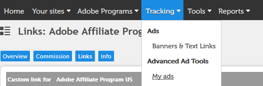
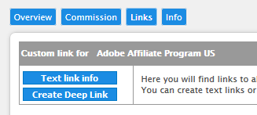
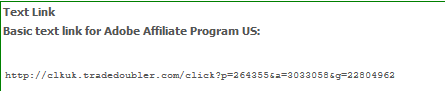

# Stock SearchBar sample app
<!-- MarkdownTOC levels="1,2,3" autolink="true" -->

- [Responsive demo](#responsive-demo)
- [Register](#register)
- [Install](#install)
- [Dependent libraries](#dependent-libraries)
- [Configuring the SearchBar](#configuring-the-searchbar)
    - [Configuration object](#configuration-object)
    - [Filters object](#filters-object)
- [Styles](#styles)

<!-- /MarkdownTOC -->

When dropped into your page, this sample library creates a gallery of Stock search thumbnails. While you can add different search parameters, it is designed to search on a similar image URL (such as the main image on your page), or on keywords. Keyword extraction is provided by the [Keyword Extractor](https://github.com/michaeldelorenzo/keyword-extractor) package by Michael DeLorenzo.

__New as of July 26, 2018__ In the 1.2 release, there is now support for video thumbnails. See the video thumbnails [demo located here](https://cfsdemos.com/stock/demos/searchbar/sdk_searchbar-video.html). Adobe Stock does not support similarity search for videos yet, so only keyword search is part of this demo. There are two new configuration commands added:

```
    videoSupport: true,
    ctaLink: 'video',
```

The command `videoSupport` enables video thumbnails. This detects if an asset has a video preview, and adds this preview as a dynamic video thumbnail that plays when hovered over it. It also adds a video icon to the image.

The command `ctaLink` controls what call-to-action (CTA) link appears above the thumbnails. The default language is "First month free with Adobe Stock annual plans." If `ctaLink` is set to `video`, the link text will read "Save money on Adobe Stock videos." (Default value is `fmf` for the "first-month free" promotion.)

## Responsive demo
https://cfsdemos.com/stock/demos/searchbar/sdk_searchbar1.html

## Register
Before you use the sample, you will need to register for an [Adobe Stock API key](https://console.adobe.io/integrations). Also, if you want to get paid for referral traffic, sign up to become an [Adobe affiliate](https://www.adobe.com/affiliates.html). Otherwise, you will not receive credit for traffic you generate.

For more information about the Stock API and the SDK, see [Getting Started](https://www.adobe.io/apis/creativecloud/stock/docs/getting-started.html).

## Install
All files are pre-built in the dist folder, otherwise you can run `npm install` and `npm run build` to build your own copy. The library includes minified versions of jQuery, Masonry, and the Adobe Stock SDK for JavaScript; these are not dependencies of the main script but are required to reside in the same folder. You can supply your own versions if you prefer. The script will load jQuery if it does not detect it already loaded. 

To use on your site:
1. Either:
    - Download and extract [searchbar-1.1.zip](searchbar-1.1.zip) to your web server. It should extract as a folder named "searchbar."
    - Copy the `dist` folder to your server and optionally rename to "searchbar". This is not required, but matches the embed code example, below.
2. Include the embed code in your page, preferably at the bottom before the closing `</body>` tag. 
3. Identify where you want the thumbnails to appear, and note the selector name. Change the `contId` to match the CSS selector name and the gallery will build itself inside that container. By default, the gallery will appear in a DIV with an id of `astock-searchbar`.
4. To test, your page must be hosted on a web server or in a localhost. Open a web inspector, and if any files are not loading, make sure the paths to the CSS and JS files are correct. The example code expects that if your page resides at the root of your site, then the searchbar files are located in a folder named `searchbar` also located at the root. If it is working properly, you should see some search results based on the title of your page.
6. Configure the options as described below under [Configure](#configure).

```html
<!-- Begin Stock SearchBar -->
  <!-- SearchBar container (place this where you want the SearchBar to appear) -->
  <div id="astock-searchbar" class="astock-searchbar unfloat"></div>
  <!-- SearchBar styles -->
  <link rel="stylesheet" type="text/css" href="./searchbar/sdk_searchbar_styles.min.css">
  <!-- SearchBar script include -->
  <script type="text/javascript" src="./searchbar/sdk_searchbar.min.js"></script>
  <script type="text/javascript">
    StockSearchBar.init({
      // container where SearchBar will appear
      contId: '#astock-searchbar',
      // additional filters
      filters: {
        // first param is CSS selector of element containing keywords
        // second param is how many keywords to include
        WORDS: ['title', 3],
        // for high contrast, use '000000,ffffff'
        FILTERS_COLORS: '',
        /* To enable search on similar url:
         * Enter selector of parent element containing image
         * leave blank or remove to disable */
        SIMILAR_URL: '',
        THUMBNAIL_SIZE: 220,
        LIMIT: 16,
      },
      // Stock api key registered on console.adobe.io
      // DO NOT USE THIS ONE!
      apiKey: 'b3f036780e4148b6a3f845bbe4c6de45',
      // Name you choose for app (whatever you want)
      appName: 'Stock-Searchbar/1.0',
      // Your affiliate data--Change these values to receive credit!
      programID: 264355,
      advertiserID: 3033058,
      adID: 22804962,
      // experimental! create bubble tooltips over images
      tooltips: true,
    });
  </script>
<!-- End Stock SearchBar -->
```

## Dependent libraries
At a minimum, you must include the JS library `sdk_searchbar.min.js`. This script is minified using a source map which is included in the dist folder, so if you use a modern brower and open your web console, you should be able to inspect the source without needing to "prettify" it.

You will also want to include the CSS file `sdk_searchbar_styles.min.css`, although most of the search bar will create itself properly without it (and in some cases, it will create required classes). You can easily override the default CSS classes as needed.

As noted above, the SearchBar also uses [jQuery](http://jquery.com/) for various support functionality, [Masonry.js](https://masonry.desandro.com/) to layout the thumbnails, and the [Adobe Stock SDK](https://github.com/adobe/stock-api-libjs) as wrapper for the Stock API. These libraries are included as a courtesy, but you can also supply your own versions. The included jQuery version is 1.11.x, mainly for backwards compatibility, but should work with any version. If jQuery is detected, SearchBar will not load its own version.

## Configuring the SearchBar
The options are described above in the code and are mostly self-explanatory, but here is additional detail. 

### Configuration object
The `StockSearchBar` object does not accept a constructor, instead using an `init` method which takes a single argument, a config object. If you want to delay the instantiation of the SearchBar so you can change the startup options, you can create the configuration separately, and then call `init` when you want the SearchBar to assemble itself. This technique is used in the sdk_searchbar1.html reference demo, because the demo has an option to either use parameters that show image similarity search, or show keyword search.

```javascript
StockSearchBar.config = {
    // place configuration options here
};
// now initialize the SearchBar
StockSearchBar.init(StockSearchBar.config);
```

The configuration object has a few required properties:

+ `contId`: As mentioned earlier, this is the selector for the containing element which will hold the SearchBar. If this element doesn't exist, the script will throw an exception and nothing will appear.

    The sample code includes an example of a container:

```html
    <div id="astock-searchbar" class="astock-searchbar unfloat"></div>
```

    You can choose to place this DIV wherever you want the thumbnails to appear, or you can leave it out and choose a different container. If you use a different container and do not include the main `astock-searchbar` class, then a DIV element will be created with this class name.

    When identifying the `contId` you may use any valid CSS selector, but it's recommend you use an `id` selector to ensure that the SearchBar only appears once on your page. If you are unfamiliar with selectors, see [this article](https://developer.mozilla.org/en-US/docs/Learn/CSS/Introduction_to_CSS/Simple_selectors). 

+ `filters`: This is an object containing multiple search parameters, all of which are optional. See [Filters object](#filters-object), below.
+ `apiKey`: The Adobe Stock API key for your integration that you created at the [Adobe I/O Developer Console](https://console.adobe.io/integrations). For more information on this simple process, see [Register your application](https://www.adobe.io/apis/creativecloud/stock/docs/getting-started/01-getting-started_master/02-register-app.html) in the Adobe Stock Getting Started guide.
+ `appName`: This field can be whatever you wish to call your app, as long as it is not blank. This is mainly used by Adobe for troubleshooting.

#### Affiliate program information

The next three parameters are required if you want to receive credit for referring traffic to Adobe Stock. Each successful Stock subscription attributed to you will pay a bounty! For more information, see the [Adobe Affiliate Program](https://www.adobe.com/affiliates.html). It only takes a few minutes to sign up. Once accepted into the program:

1. Visit the [Affiliate publisher portal](http://reports.tradedoubler.com).

2. Click Tracking > My ads.


3. Click "Text link info."


4. In the pop-up window, copy the URL shown.


    Example:
    `http://clk.tradedoubler.com/click?p=264355&a=3033058&g=22804962`

5. Extract the `p`, `a` and `g` values from the link and assign them to the embed code as follows:

+ `programID`: `p` value
+ `advertiserID`: `a` value
+ `adID`: `g` value

Internally, SearchBar will construct an Affiliate "deep link" URL around each thumbnail containing all your tracking data that looks like this:

`http://clk.tradedoubler.com/click?p(264355)a(3033058)g(22804962)url(https%3A%2F%2Fstock.adobe.com%2F112930371%3Fas_channel%3Daffiliate%26as_source%3Dapi%26as_content%3Db3f036780e4148b6a3f845bbe4c6de45)`

Which when opened, will end up at this page on Adobe Stock:
`https://stock.adobe.com/112930371?as_channel=affiliate&as_source=api&as_content=b3f036780e4148b6a3f845bbe4c6de45?tduid=e2eeff44555a6a084e121b95727903b4&as_channel=affiliate&as_campclass=redirect&as_source=arvato`

Before it reaches this destination, it will arrive at a tracking page where the Affiliate team will measure and record your conversions. If you have any questions about your account or the program, contact the Affiliate support team at AdobeAffiliates@arvato.com. 

There is one more property, which is optional (omitting it will result in a default `false` value):

#### Tooltips option (beta)
+ `tooltips`: This is somewhat experimental setting which uses JavaScript and CSS to create tooltip rollovers over each image that are customizable in CSS. Each tip is created dynamically based on the `title` attribute of the Stock image item.

    This setting has not been tested on mobile devices, as it relies on the `mouseenter`/`mouseleave` events. If you run into issues, I recommend disabling it or leaving it out, in which case it will default to `false`.

### Filters object

The filters object includes a few commands which have special functionality, but otherwise the commands are the same as the Query Parameter Object settings found in the [Stock JavaScript API SDK](https://github.com/adobe/stock-api-libjs#query-parameter-object). See below for a few examples of adding your own filters. These filters are included by default, but are optional.

+ `WORDS`: Unlike the Stock SDK command with the same name, requires an _array_ input of two arguments:
    * CSS selector where keywords are found on the page (string)
    * Number of keywords to extract (integer)

    This feature works by collecting the textContent node of the target object (such as the `<title>` element), and running it through the highly useful [Keyword Extractor library](https://github.com/michaeldelorenzo/keyword-extractor), which removes common "stopwords" (like "the", "a", "is"). 

    __Note:__ The SearchBar currently only supports US English keywords, but the Keyword Extractor library supports several languages, and Adobe Stock supports dozens of languages. If you have a need to support other languages, please open a [new issue](https://github.com/chfabbro/astock-searchbar/issues/new) or [contact us](stockapis@adobe.com).

    Example: Extract the first three keywords from the `<h1>` tag.

    ```
    <h1>Chalet house on the edge of a forest</h1>
    ```

    `WORDS` parameter:

    ```
    WORDS: ['h1', 3],
    ```

    Resulting search query to Stock:

    ```
    ?search_parameters[words]=chalet house forest
    ```

    Note that the more keywords selected, the _narrower_ the search results. For best results, choose 1-3 keywords.

    If the `WORDS` command is removed or set to null, SearchBar will not search any keywords.

+ `SIMILAR_URL`: This command also operates a little differently than the Stock SDK version. It accepts a string parameter of a CSS selector containing an image element. It will find the URL of the first image it encounters, and send that URL to the Stock API. Stock will return images which look visually similar to that URL. Note that you can combine similarity search and keyword search, however keep in mind this will also limit the total search results.

    Example image tag:
    ```
    
    ```

   `SIMILAR_URL` value to get the value of this tag which has an element id of "hero":

    ```
    SIMILAR_URL: '#hero',
    ```


+ `THUMBNAIL_SIZE`: Size of image thumbnails returned (integer). CSS will be applied to fit the images within the SearchBar, so you may want to increase or decrease this value depending on the size of your gallery. If you leave out this command, the default size is 500 pixels. These are the only valid values--any other values will cause SearchBar to find the nearest size. Note that 500 and 1000 pixel sizes include watermarks.

    * 110px
    * 160px
    * 220px
    * 240px _tall_ (with variable height)
    * 500px: Includes watermark
    * 1000px: Includes watermark

+ `LIMIT`: Number of images returned (integer). The max images returned is 64 (default value is 16). 

    Note that SearchBar only returns the first page of results (API command is `offset=0`), regardless of the number of results. If you need to support pagination, please open a [new issue](https://github.com/chfabbro/astock-searchbar/issues/new) or [contact us](stockapis@adobe.com).

#### Example filters
+ To only include illustrations and vectors in your results, set these parameters:

```
    FILTERS_CONTENT_TYPE_ILLUSTRATION: 1,
    FILTERS_CONTENT_TYPE_VECTOR: 1,
```

## Styles
You can either edit the styles in the uncompressed `sdk_searchbar_styles.css` (located in the `src` folder), or override them on your page.

Some classes are added programmatically when the SearchBar is created. These include:

+ `.astock-searchbar`: Main class for SearchBar container. If this class does not exist on the container div (`contId`), then a new DIV child will be created under the `contId` parent, and this class will be applied there.
+ `.astock-searchbar-header`: Contains the Adobe Stock logo and header.
+ `.astock-searchbar-wrap`: A wrapper around the thumbnails which allows scrolling.
+ `.astock-searchbar-body`: Container for the thumbnails.
+ `.astock-searchbar-item`: Container for each thumbnail. This width, along with the width of the overall SearchBar, will have the most direct influence on how many columns of thumbnails appear.
+ `.astock-searchbar-tip`: If tooltips are enabled, this controls the look of the tooltip bubble.
+ `.astock-searchbar-fadein`: Controls visibility of the SearchBar, and is added when all images have loaded.
+ `.item-small`: A mix-in class that only is added if the SearchBar falls under a minimum width (currently 150 pixels.)
